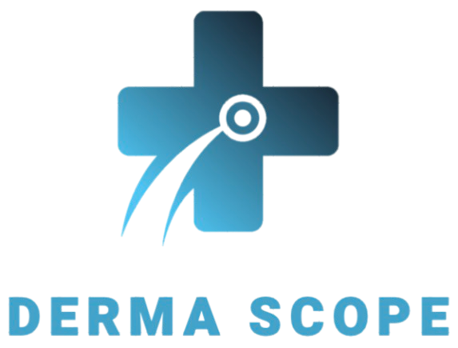
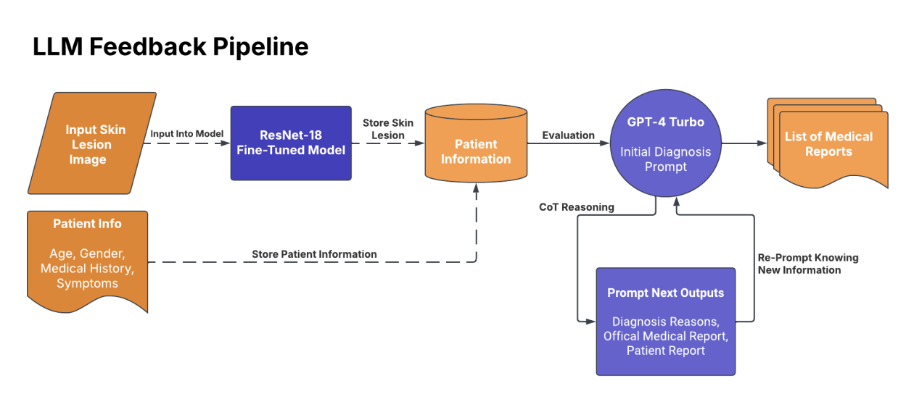
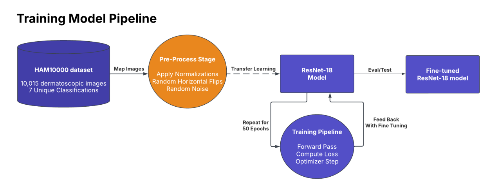
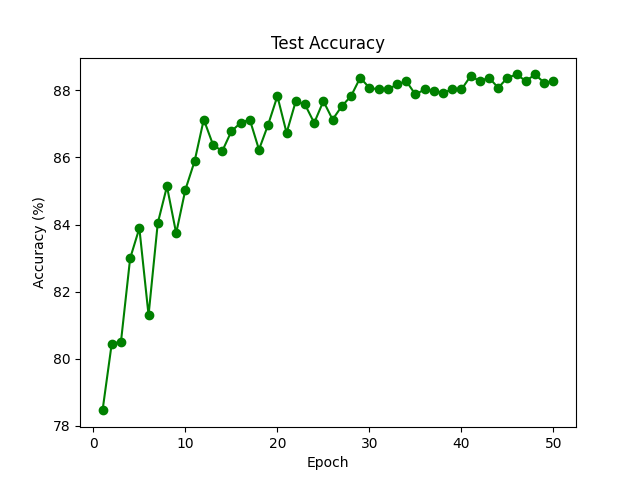
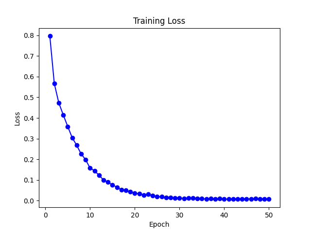

## Overview
DermaScope is a machine learning-powered application designed to assist in skin condition analysis using a CNN model.

## Setup Instructions

### 1. Create a Virtual Environment
It is recommended to use a virtual environment.

```sh
python -m venv venv
```

Activate the environment:
- **Windows**:
  ```sh
  venv\Scripts\activate
  ```
- **Mac/Linux**:
  ```sh
  source venv/bin/activate
  ```

### 2. Install Dependencies

After activating the virtual environment, install the required dependencies using:

```sh
pip install -r requirements.txt
```

### 3. Run the Application
To start the application, use the following command:

```sh
python main.py
```

## Model Images
Below are visual representations of our model pipeline and training progress:

### Report Pipeline


### ResNet18 Model Architecture


### Test Accuracy


### Training Loss


## Logo
Our project logo:
